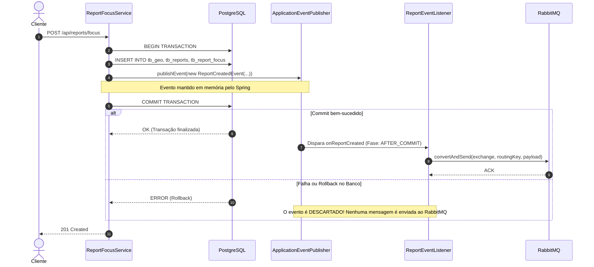

# 02. Resiliência de Mensageria e Consistência Transacional

## 1. O Problema: Dual-Write Hazard

Em arquiteturas orientadas a eventos e microsserviços, um dos erros mais comuns e críticos é o **Dual-Write Hazard** (risco da escrita dupla em dois sistemas de armazenamento distintos — aqui, PostgreSQL e RabbitMQ).

### 1.1 Como estava o código antes da refatoração:

No [`ReportFocusService`](../src/main/java/br/ifpb/project/denguemaps/pdmreportms/service/ReportFocusService.java) e [`ReportSymptomsService`](../src/main/java/br/ifpb/project/denguemaps/pdmreportms/service/ReportSymptomsService.java):

```java
@Transactional
public ReportResponseDTO criar(ReportFocusRequestDTO dto, UUID cidadaoId) {
    // 1. Salva no banco de dados (ainda dentro da transação aberta)
    ReportFocusEntidade salvo = focusRepository.save(foco);

    ReportResponseDTO resposta = ReportMapper.toResponseDTO(salvo);

    // 2. DISPARO IMEDIATO PARA O RABBITMQ (PERIGO!)
    reportPublisher.publishReportEvent("report.focus.created", resposta);

    return resposta;
    // 3. O COMMIT NO POSTGRESQL SÓ ACONTECE AQUI, NA SAÍDA DO MÉTODO!
}
```

### 1.2 Por que essa abordagem era perigosa?

1. **Mensagem órfã em caso de Rollback**:
   Se após a linha do `publishReportEvent` ocorresse qualquer falha (queda de conexão com o banco, violação de constraint de banco, erro no JPA flush ou erro de I/O), a transação no PostgreSQL sofria **ROLLBACK**.
   Porém, a mensagem no RabbitMQ **já havia sido entregue**!
   Consumidores como o `pdm-geo-ms` processavam um evento referente a um `report_id` que **nunca existiu** no banco relacional.

2. **Supressão de Erros de Mensageria**:
   No [`ReportPublisher`](../src/main/java/br/ifpb/project/denguemaps/pdmreportms/producer/ReportPublisher.java):
   ```java
   try {
       rabbitTemplate.convertAndSend(...);
   } catch (Exception e) {
       log.error("[RabbitMQ] Falha ao publicar...", e);
   }
   ```
   Se o RabbitMQ estivesse fora do ar ou sem rede, o erro era engolido no log. O banco commitava com sucesso, mas o heatmap geográfico ficava permanentemente desincronizado.

---

## 2. A Solução Adotada: Transações com Domain Events (After-Commit)

Implementamos o padrão de desacoplamento baseado em eventos de aplicação do Spring (`ApplicationEventPublisher`) combinados com `@TransactionalEventListener(phase = TransactionPhase.AFTER_COMMIT)`.



---

## 3. Estrutura do Pacote `event`

Criamos um pacote dedicado (`br.ifpb.project.denguemaps.pdmreportms.event`) composto por records imutáveis e um listener seguro:

### 3.1 Records de Eventos de Domínio
- **[`ReportCreatedEvent`](../src/main/java/br/ifpb/project/denguemaps/pdmreportms/event/ReportCreatedEvent.java)**:
  Transporta a routing key correspondente (`report.focus.created` ou `report.symptom.created`) e o payload serializável.
- **[`ReportDisabledEvent`](../src/main/java/br/ifpb/project/denguemaps/pdmreportms/event/ReportDisabledEvent.java)**:
  Informa que o report foi inativado (`report.disabled`), permitindo que o heatmap remova o hexágono/ponto.
- **[`ReportVisitedEvent`](../src/main/java/br/ifpb/project/denguemaps/pdmreportms/event/ReportVisitedEvent.java)**:
  Informa que o agente de saúde concluiu a inspeção em campo (`report.visited`).

### 3.2 O Listener Transacional ([`ReportEventListener`](../src/main/java/br/ifpb/project/denguemaps/pdmreportms/event/ReportEventListener.java))

```java
@Component
@RequiredArgsConstructor
public class ReportEventListener {

    private final ReportPublisher reportPublisher;

    @TransactionalEventListener(phase = TransactionPhase.AFTER_COMMIT)
    public void onReportCreated(ReportCreatedEvent event) {
        reportPublisher.publishReportEvent(event.routingKey(), event.payload());
    }

    @TransactionalEventListener(phase = TransactionPhase.AFTER_COMMIT)
    public void onReportDisabled(ReportDisabledEvent event) {
        reportPublisher.publishReportEvent(event.routingKey(), event.payload());
    }

    @TransactionalEventListener(phase = TransactionPhase.AFTER_COMMIT)
    public void onReportVisited(ReportVisitedEvent event) {
        reportPublisher.publishReportEvent(event.routingKey(), event.payload());
    }
}
```

---

## 4. Ganhos Desta Mudança

| Aspecto | Antes da Refatoração | Depois da Refatoração |
| :--- | :--- | :--- |
| **Garantia de consistência** | Fraca: RabbitMQ podia receber eventos de dados revertidos | Forte: Mensagens só são despachadas após confirmação do PostgreSQL |
| **Acoplamento** | Alto: Serviços de negócio conheciam diretamente a infraestrutura do RabbitMQ | Baixo: Serviços emitem eventos de domínio do Spring |
| **Manutenibilidade** | Difícil: Múltiplos pontos chamavam `reportPublisher` diretamente | Centralizada: Um único listener governa o roteamento para o broker |
| **Evolução futura** | Complexo implementar Outbox Pattern | Pronto: É trivial plugar persistência em tabela de Outbox no listener |
